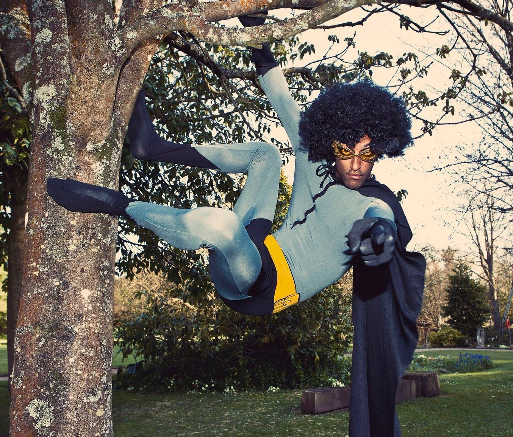
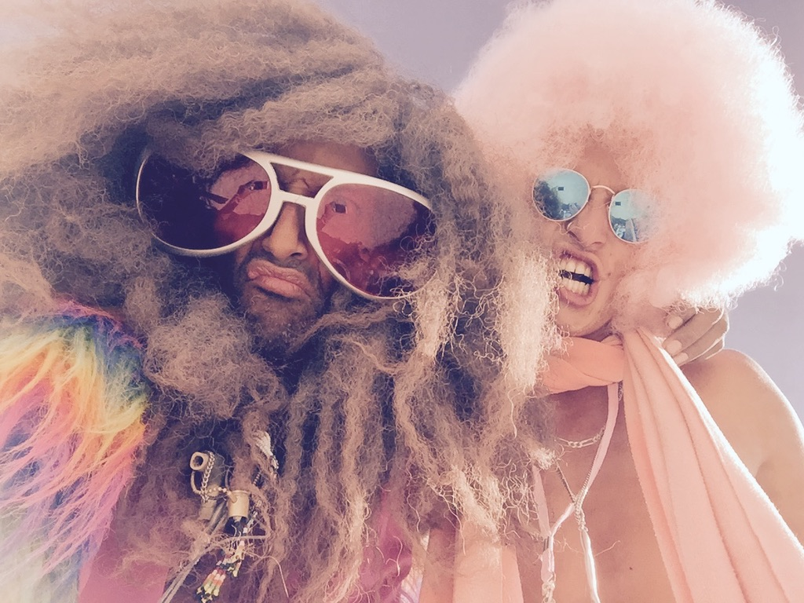
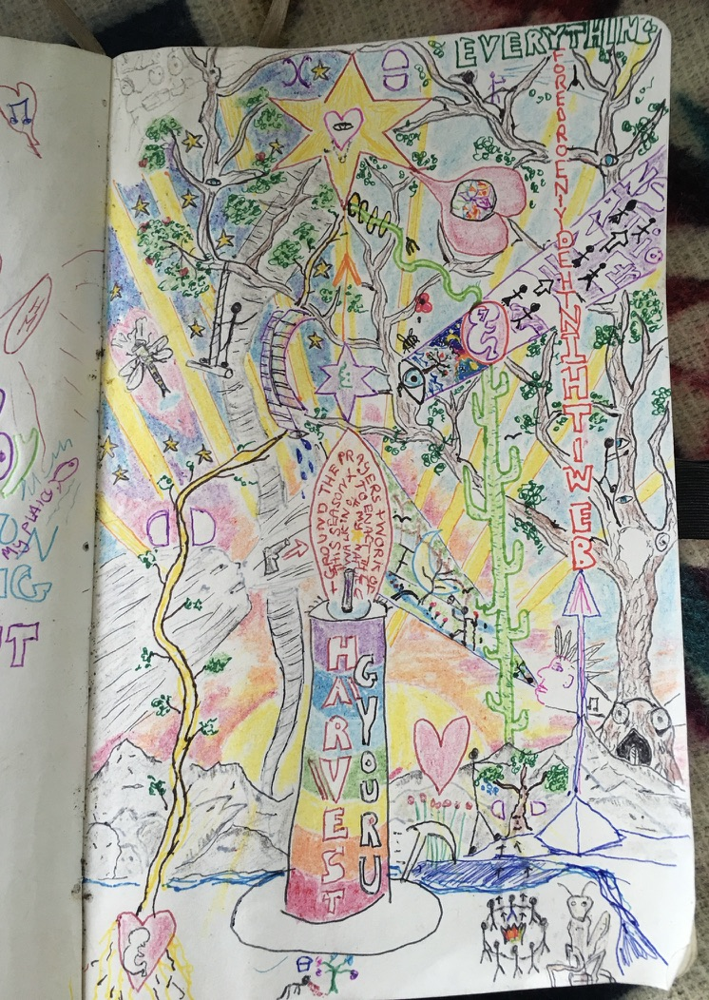
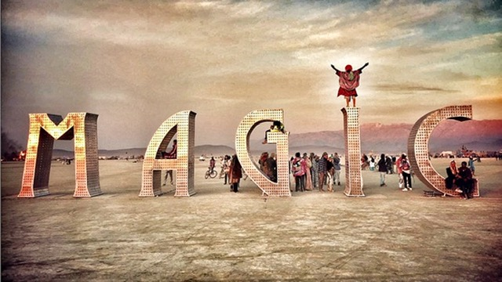
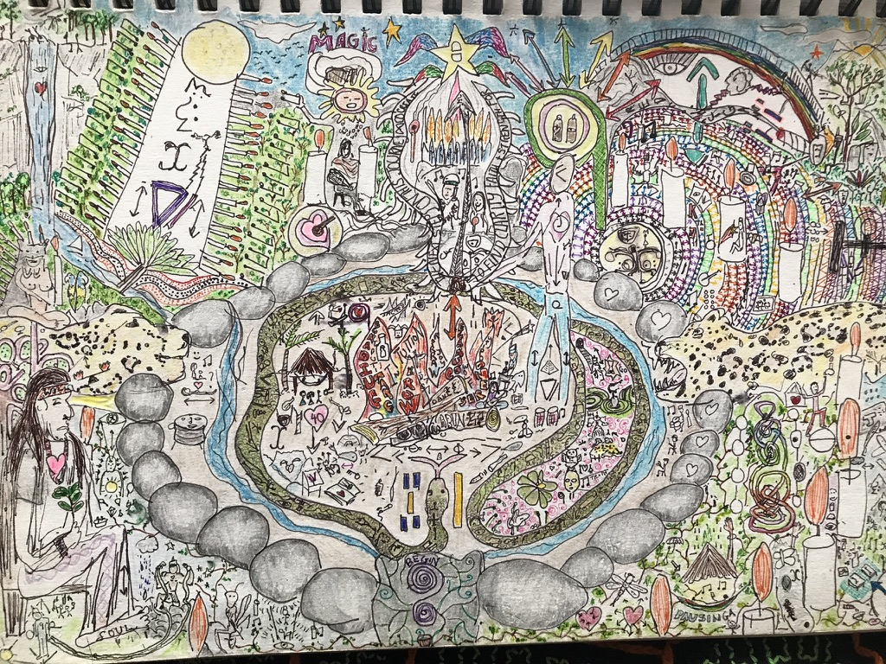

# Prologue: The Fall

## The High Life & The Core Wound

On the surface, my life looked enviable. I threw incredible events, I was a successful musician, and when some of my friends became famous, it catapulted me into exclusive circles -nights out with household names, insane parties around the globe, high-end adventures, and annual trips to Burning Man. Somehow I was moving through these rarefied worlds with access that  opened many doors.

But underneath, I carried an old wound. At four years old, on my first day of school, I was surrounded by children chanting "Blackjack golliwog, blackjack golliwog." Half-African, half-English, raised in a white family - that was the moment I learned I was different, and that difference meant I didn't belong. That wound followed me everywhere, even into spaces where I was welcomed and celebrated.

From age 19, I'd dedicated myself to healing this wound - Landmark, Tony Robbins, the Hoffman Process, Mankind Project, studying NLP with John Grinder, meditation retreats in India, Vipassana, Five Rhythms, coaching certifications. Over the years I became more and more free, pretty much thinking I was out of the woods. Little did I know that the exclusive circle dynamics were about to activate something I thought I'd transcended, sending me into the deepest abyss yet.

## The Hieroglyphics Breakthrough (2014-2016)

What most people didn't know was that during these peak years, I was quietly developing something revolutionary.

It started in 2014 with ayahuasca ceremonies. The medicine would flood my mind with hurricane insights - business ideas, poems, profound realizations - and I'd furiously scribble them into notebooks. But the next morning, I could only read about half of what I'd written. Devastating. Incredible ideas, lost to illegible handwriting.

After this happened repeatedly, I evolved a strategy: outline lettering. Stencil-style writing that forced me to focus on form, even in powerful altered states. This worked for a while, but then came the breakthrough that changed everything.

One day, I realized it would be far more effective to draw a picture for each ceremony, with all the information contained within it. Prayers became fires with smoke flowing up to stars. Growth intentions became trees with wishes in their leaves. App ideas became phone shapes with symbolic reminders inside. The result wasn't just functional - it was beautiful. Compellingly visual data storage.

This coincided with deep meditation on Orion symbols (i was in a deeply hippy moment of life). Synchronistically, I discovered Anthony West's documentary on ancient Egypt. He described how mystery school initiates would drink psychoactive tea and scan hieroglyphic teachings - symbols that could represent multiple concepts simultaneously, allowing the brain to process vast amounts of information and create synergy between ideas. Both hemispheres engaged, unlike with linear text.

It was a revolutionary moment. It felt like i was rediscovering an ancient technology for recording and processing consciousness.

_[This is the first eureka image - my first ceremony notes in picture form]_

## Burning Man Breaking Point (2016)

By 2016, the exclusive circles that once felt exciting had become suffocating. While I treasured my genuine friendships with people who'd been famous since before their success, certain contexts - particularly in LA - brought out hierarchies that triggered my old wound. New crowds, fame seekers, imagined pecking orders that made me question my place and worth.

In August 2016, Burning Man cracked something open. Amid the desert dust and temple fires, I felt a surge of possibility: a sense that I could break away from this comparison trap and rebuild life on new terms. That feeling stayed with me and led to my decision to break away and go travelling. I resigned from my events business and started planning a 2-year adventure to write a book and follow this intuition.

_[Visual: Burning Man moment - that's me standing on the i of Magic!]_

## Colombia Adventures & Travel Integration (2017)

In January 2017, I launched my planned adventure, starting in Colombia to support a Vision Quest with my teacher. What I didn't expect was how this journey would evolve my visual practice in unexpected ways. With time to really work on ceremony pieces and document multiple experiences, something new emerged.

During an adventure across Colombia with my friend George - including an exhilarating trip through the Trampolín del Diablo, dramatic mountain roads with huge drops and remnants of old crashes that felt atmospheric and alive rather than terrifying - we had such incredible conversations and experiences that I found myself including our entire journey in my next ceremony picture.

The travel story proved more satisfying than the ceremony content itself. From then on, my ceremony notes naturally became travel diaries, documenting not just the spiritual experience but the adventure of getting there. I was organically developing a visual language that could capture both inner journeys and outer adventures.

_[this is one of my Columbia travels ceremony notes ]_

## The Financial Collapse

I was four months into my travels in Guatemala, on a 3-week tantra course staying in an avocado treehouse in an ashram (I know! 🤪), when the thunderbolt hit. I received a message regarding ownership issues with my London flat. Legal complications forced me to return to the UK immediately and buy out the entire mortgage, wiping out my funds. I borrowed from family and sank into desolation.

Suddenly, I couldn't continue the adventures that had become my identity - no Mexico trips, no Burning Man, no global wandering. At 40, watching younger, wealthier friends surge ahead while I faced isolation and financial ruin, I crashed hard. Six months of digital numbness followed - endless TV, YouTube binges, phone switched off for weeks. Some nights I'd watch episodes until 10:30am, then wake up too exhausted to do anything productive.

Hardly any of my friends knew what I was going through. When I tried going out, I'd be hit with crippling social anxiety, especially around those exclusive circles where I used to move freely. I'd lost my identity - at first by choice, but as I sank deeper, the cost felt insurmountable. I'd go mute around people I genuinely loved, unable to access the confident person I used to be.

_[an ominous view of a storm from my avocado treehouse! ]_
## The Eureka Moment

But during this dark period, something extraordinary happened. A breakthrough that would transform everything.

I suddenly realized I could bring the sophisticated visual language I'd spent years developing in ceremonies into daily diary format. I could have that same special feeling of translating raw experience into visual expression, but applied to ordinary life - survival, recovery, the slow journey back to wholeness.

On September 13, 2017, I picked up a pen and created the first page. Not as art. Not even as "art." Just as the most engaging way I could find to survive.

The diary was born from crisis, but it was powered by years of systematic innovation.

_[my first ever diary page! ]_

