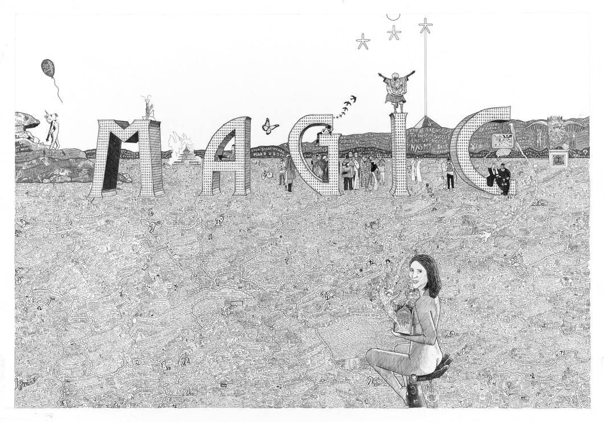
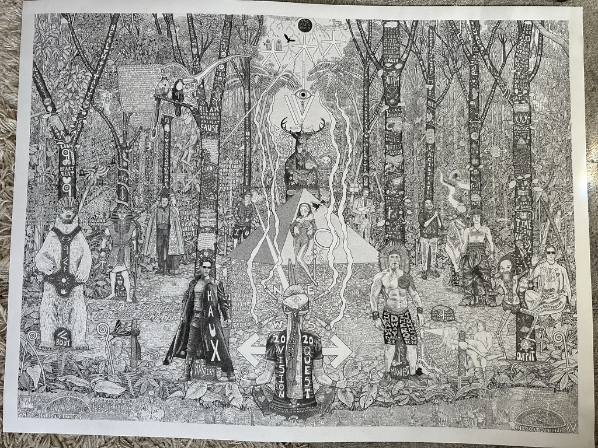

# Act I: Initiation

## The First Pages

The illustrated diary begins in the wreckage of a once-glamorous life. After financial disaster forced my return from travels, I found myself isolated, ashamed, lost in six months of digital addiction. But there was also a spark of a pivotal idea that drove the decision to start documenting:

_"However bad my life feels at this moment, I have to operate from the premise that at some point I'm going to make it through and achieve my dreams. If that is the case, it would be a wonderful self-study to track my journey from rock bottom to success... and a wonderful thing to be able to share with my kids and future generations."_

On September 13, 2017, I picked up a pen and created the first page. At first, it was basic, rudimentary. But something in the act of drawing slowed the storm, gave me something to hang onto. **One image at a time, creation became a lifeline** - a mirror pulling me back into feeling.

There was an alchemy in this process. The content I was documenting - struggles with digital addiction, a book that felt impossible, the gap between dreams and reality - somehow became beautiful when translated into visual form. My mind began to frame experience differently. Looking back through pages, I could see that life wasn't nearly as awful as I was painting it in my head and emotions. The diary was transforming pain into pathway.

_[This is an example of an early diary page:  the bottom left section features an image of me on a desert island in a jail cell with clouds above. Directly above one of the clouds is a stop symbol, an image of a TV, and an image of a bed for late nights. This is what's blocking the connection upwards which has an arrow with a key inside pointing towards the Sun which has images inside of the traffic symbol for work with a plus symbol next to a circle of little circles which represents community connection and coming together and the 💸]

## The Black Pen Discovery

Through those early pages, something began to shift. The act of creation - untrained but intentional - became a lifeline. Those first pieces were already beautiful in their own way - colourful, with defined systems for separating each day, sprawling content that people genuinely loved.

Then came a discovery that would define my visual language forever. I randomly found a pack of black pens - fine liners in different weights. Suddenly, I could create hierarchy in my drawings. Thick lines for emphasis, thin lines for detail, medium weights for structure. This led me down a path where each piece evolved to have a central drawing or theme with all the diary content arranged around it.

Initially, I colored everything in, but coloring took enormous amounts of time. To keep up with the diary, I started moving to the next piece with intentions to color later. Then something became apparent: because there was so much visual complexity and writing within each piece, the black and white lent itself much more to legibility. As I continued, a distinct style appeared.

The simplicity of black and white brought clarity to the visual complexity of the work. It made the work more legible, more powerful. With just these pens, I had everything I needed - and my individual style was born.

## Visual Prayer Innovation

Seven months into keeping the diary, I stumbled into what felt like magic. I was still periodically relapsing into digital addiction, and upon starting a new page, I realized I could design the theme of the picture to portray the goal of what I wanted to happen in that time. Each piece could be a real-time prayer of intention. This meant the content of the diary - my life as it happened - would fill up around the central intention.

It felt like a unique and powerful way to repetitively program the subconscious to bring about the results I was working to achieve. In this first example, I drew a disc representing the habit of digital addiction, with me in the middle splitting the habit in two. I found myself staring at a visual spell.

And it worked! (For a while 😉)

I realized each page could hold an intention, transforming drawing into a form of prayer. It wasn't "art" yet. It was **functional ritual**.

## External Validation

The first hint that this might be more than personal therapy came unexpectedly. At an Apple Store, while waiting for my phone to be repaired, I was updating the diary - working on a daffodils piece. The man helping me at the Genius Bar, Vijay, leaned over and said he really loved my work. I pushed back, insisting I'm not good at drawing and I'm not an artist.

He shared that he was an artist who'd been to art school, and assured me that I very much am an artist. Then he hit me with an insight that floored me:

_"The hardest thing for an artist is to develop a style. You already have one!."_

It was the first time anyone had acknowledged me as an artist in this way. People in ceremonies had called my pictures "art" before, but I'd always rejected that notion due to my limited technical drawing skills. But Vijay, being an artist himself in art communities, reflected back that technical skill wasn't the point - having a unique identity and style was the hardest part, and I already had that.

It was the first moment I realized that what I was doing might have a unique artistic identity, not just personal value.

## The System Emerges

What began as survival was becoming systematic innovation. Without realizing it, I was developing what would become a comprehensive visual language for consciousness - a way to translate not just complex emotional and spiritual experiences, but the entire texture of daily life into compelling, readable images.

This wasn't just about high-level spiritual moments. It was archive documentation of everything: what workout I did, how many hours I spent on the diary, recording the contents of interactions, notes on books, podcasts and TV shows I watched, the simplicity of a ladybird landing on my lap when I was thinking a certain thing. The mundane and the magical, side by side.

The diary format evolved quickly too. Starting at A4 in September 2017, by New Year 2018 - around the time I discovered the black pens - I'd moved to double pages, A3 spreads. Each page was becoming more sophisticated, more intentional, more powerful. I wasn't just documenting my recovery; I was inventing a new way to process reality itself.

For instance In the above two pieces I began to also use the pieces for task management.  Using symbols  in the rocks for the daffodil piece and the foreground panels in the disc piece.  A life planner, diary and goal system dynamically wrapped in a pretty picture.

Without realizing it, I was beginning to discover something far more powerful than I had ever set out to find.

## The Cosmic Contract

A pivotal transformation came through an intense dream in August 2018. For context I'd been in a slightly chaotic time - trying to balance some socialising, regressing into past drug taking and working to reconcile the contrast between how people saw me (as pre-breakdown Deji} and how i truly felt inside.

A few days later, staying in a hotel after performing as a percussionist at a bar mitzvah in northern England, I had an extraordinary dream. I was visited by two star beings adorned in hooded robes - they had returned to continue work we'd been doing together after two years. They came with a contract, and we went to Tyringham Hall, a grand property that in my dreamworld always represented the highest expression of the divine, where we met with a female president to sign the contract together.

The diary page features a hand signing this cosmic contract, though I've never filled in what the terms should be - perhaps some agreements are too profound for words, their meaning revealed only through living them.

From this point, the style of my diary becomes cohesive, with a distinctive change that made everything look much more aesthetically refined. It was as if I'd received official authorization for the work to evolve into its destined form.

These star beings would later appear on Orion's Belt in almost all of the large-scale exhibition pieces, watching over the artistic evolution like cosmic witnesses confirming I was honoring the original agreement.

## The Diary's First Birthday

By September 2018, exactly one year after starting the diary, something remarkable happened. I was facilitating a UNICEF conference in Geneva - long hours, early starts, late finishes. One morning I realized it was the anniversary of having started my diary and reflected on how much it had helped me recover from my depression.

Instinctively, I wrote a long Facebook post explaining the journey of my diary and what it had done for me. When I returned that evening and logged on, I was shocked and humbled by the response. There were hundreds of likes and 225 comments - an unprecedented outpouring of love and appreciation. It opened up dialogue with friends who had no idea what I'd been going through. Many were shocked, still seeing me as the cool mover and shaker partying around the world.

It was the first glimpse that this work might resonate far beyond my personal recovery.

## "Everything is Perfect"

The breakthrough that would change everything came through ceremony. I partook in an ayahuasca experience and had a powerful moment of really coming back to self. At this time I would often find my fluency and flow, but it usually wouldn't completely last. This time felt different - it launched me into a much more connected space.

The insight that came through was profound: "Everything is perfect. No matter how things seem, the universe is conspiring to support you, even if it appears to the contrary. The universe is in order and there is a mystical architecture that feeds you if you stop resisting it."

A few days later at a kambo treatment with others from the ceremony, my friend Paul asked if I was going to do the Vision Quest in Colombia. I had previously thought I'd never return to that "hell hole" after my difficult first experience when i supported there. Even in the flowing state I was in, I was  hesitant. Paul then said something that changed everything: "If you do it, I will support you."

Vision Quests have a structure where someone supports you during your process - they pray specifically for you the entire time, sending you energy through intention. This was the moment I decided to face my fear, recognizing it was something I needed to confront. Though Paul would never make it to Colombia (he got stuck in Brazil), I'll always be grateful for being the trigger that set me off.

This ceremony piece marked a turning point - not just in my recovery, but in my willingness to face the deepest challenges ahead.

*Next: Act II—A journey that would take me from my flat to the Colombian jungle, and into my first Vision Quest.*

# Act II: Devotion

If Act I was survival and discovery, Act II was commitment and expansion.

## The Prayer Ties Initiation

I took part in my first Vision Quest - a traditional Lakota initiation designed to cleanse body, mind, and soul. Four days, four nights, no food, no water, alone in a small clearing deep in the Colombian rainforest. Just me, a tarp, mosquito net, and the elements.

The preparation involved making prayer ties - 405 small cotton squares (101 for each direction plus medicine). Each held tobacco and sage, wrapped with our prayers, tied together with red cotton without knots so the prayers could run pure and undisrupted. I'd never done this before and had wrapped my prayer ties around a stick to bring to Colombia.

When it came time to lay them around my quest spot, disaster struck. I'd put too much space between each prayer, hadn't fastened them tightly enough. A whole bunch fell off. It took three of us 45 minutes just to get them around once. After so much preparation, I broke into tears. One of the leaders reassured me: "This happens - it just means you have some untying to do."

## My First Vision Quest - Forest Lessons

What followed was three days of nothing but unwrapping prayer ties in the rain and mud. I was on a hill, losing my balance, slipping, falling through the ties, breaking the string, landing on my back facing the sky. At that point I burst into laughter and realized "okay, this is where I'm at."

But being in the forest without food or water, everything becomes metaphorical. I realized my prayers in life were as tangled as these prayers in my hands. The process of slowly unraveling them had profound meaning - each knot undone was internal work made visible.

The forest had a language. So did my soul. In that stillness, in the absence of everything, I began to hear something deeper.

When they came to collect me, I was weak but transformed. Just before entering the final sweat lodge, we were given tobacco to offer prayers to the fire. I put my prayers deep, aimed them at the four directions, then raised my fist to the sky - and directly above me, an eagle soared. It was a divine message that spirit was with me. I burst into uncontrollable tears, feeling incredible relief and new energy entering.

## Shadow Integration

The first piece after the quest depicts a dream I had on the night I returned - one of the most powerful dreams of my life. In it, I was being hunted by demonic spirits, until I suddenly realized I was dreaming. I flew up, away from danger, over a lake, and back to Tyringham Hall where a divine being gifted me incredible powers.

What followed was a wild series of mythic dream adventures, all of which are drawn in the diary. But at the heart of it was one moment: I found myself in a final battle with my shadow self. We flew through the air, locked in combat. I was strangling him when he looked at me and said, "I don't have the will to fight you anymore."

Without thinking, I replied: "I love you, you cunt." 😆

In that moment, two aspects of myself - light and shadow - came back together. The split I'd been living with since the depression began to dissolve. I felt, for the first time in months, like my old flowing self was returning.

## Scale Expansion

When I emerged from the quest, everything had shifted. My sense of self had been reconfigured. There was a clarity, a spaciousness, and an inner power that hadn't been there before. To mark this change, I moved up to A2 format - double-page spreads when opened. The scale matched the expansion I felt inside.

From this point, I was permanently catching up with my diary. Previously I'd been completely up-to-date, making notes at the end of each day. But because the quest piece took so long and life started accelerating, I fell behind. One piece from this period shows a ship heading toward the pyramid on the horizon but being blown off course - into an incredible project called Electric Jam that synchronistically landed on my birthday. The content of the diary becomes the ocean, showing how new adventures kept pushing me further behind even as I aimed for my destination.

Little did I know it would be nothing compared to how far I'd lag behind later! But the quality shifted dramatically - they started to look really impressive.

## Generational Vision

One piece from this period shows how the diary was becoming more than personal recovery - it was evolving into life architecture. At my sister's half-brother Lika's 40th birthday, I met his great-grandmother Winifred. She was 102, still living independently, climbing stairs daily, dancing when music played. Her secret? "Drink a little bit of whiskey every day," she told me in her big Guyanese accent.

I captured a photo of her with two-year-old great-great-granddaughter Ariana on her knee - 102 and 2, a century of life bridged in one image. Knowing I'll be an old father myself, I drew them as the centerpiece with the words: "Thank you Winifred for being a living embodiment of who I pray to become for my future family."

But the real innovation was in the background. I mapped my entire life vision along a river - showing myself rowing against current winds, the jetty of my first quest, three more quest jetties ahead, and finally a pyramid representing the culmination of projects I dreamed to manifest. At the time I thought that pyramid was something else entirely. Now I realize it was this exhibition.

The diary was becoming a systematic tool for generational legacy planning.

## The Marathon Commitment

At one point in the year, I was falling so far behind that I came to a reckoning. I worked out that to catch up, I'd have to dedicate eight hours a day, six days a week, for two and a half months! This seemed completely insane - a full-time job's worth of hours to do my diary!

Yet I kept falling back to the context of the Vision Quest. Something about having to unravel those prayer ties for three days felt very connected to this ridiculous task ahead of me. I knew I needed to continue. After all, I had two years of diary chronicled - it would be a profound shame to stop there.

That night I went to bed and asked my superconscious mind to tell me what the theme for the next page should be in my dreams.

## The Bridge

I was given an image: the Ponte Vecchio, the iconic bridge in Florence with buildings built upon it. In my dreamworld, buildings often symbolize different states of being, so it felt like the perfect metaphor.

The resulting bridge piece depicts this dream vision. The buildings on the bridge contain emotional stages: some fully inked, others just penciled in. They read like a timeline of inner struggle, with phrases like "Is it worth it?" and "Can't go on" scattered across the early structures.

At the center beam, written faintly in pencil, are the words: "There is no turning back."

A line of commitment - a vow to finish the path. On the far side of the bridge is the magical destination - a recurring symbol in my work: a pyramid with a line rising up toward Orion's Belt. A cosmic goal. A visual promise.

Even in overwhelm, the way forward was still there - one page at a time.

## The Butterfly Emerges

After completing the bridge piece - that profound commitment to stick it out and go full-time catching up with my diary - the next image that came through felt like destiny. A butterfly about to take off, having emerged from its cocoon. Pure transformation in visual form.

But this wasn't just any butterfly. I accessorized it with my signature elements: my turban with a feather coming out the top, and my Nike Air Max trainers for each of its legs. It was metamorphosis, but unmistakably me - past, present, and future converging in one image.

Just as I was a few days away from completing this piece, serendipity struck. At Notting Hill Carnival, I met a woman named Chrissy who would change everything. Her simple words - "Why is this in a book? You're an artist!" - hit like lightning. The butterfly wasn't just emerging; it was about to take flight at an entirely different altitude.

What followed was the decision to scale up dramatically - to move from A3 diary pages to meter-wide exhibition pieces. The butterfly had predicted its own transformation.

# Act III: Transformation

If Act II was commitment and expansion, Act III was breakthrough and recognition.

## The Carnival Revelation

By the time I reached the end of the butterfly piece, I was nearly caught up. After two months of relentless effort - eight hours a day, six days a week - I was finally about a week away from being completely up to date with the diary. I felt lighter, more alive, and for the first time in a long time, in a really good place.

Then came the unexpected spark.

I live in the heart of Notting Hill, home to Europe's largest street festival. That year, I hadn't planned to go to carnival - I was still recovering from the diary marathon. But life had other plans. I was swept into a wild, serendipitous adventure that led, eventually, to my house, with a few new friends in tow.

At some point, I found myself showing them my diary. One of the women, Chrissy, grew very quiet as she turned the pages. Then she looked up:

"Why is this in a book?"

I blinked, confused. "Because... it's my diary?"

"No, babe. You don't understand. You're an artist. This is something special. These need to be big pieces - gallery pieces. This is like... Frieze-level."

I was completely gobsmacked. I knew the work was meaningful to me, but I had never thought of it as "art" in the formal sense. I hadn't studied art. I didn't know the art world. I was just making sense of my life the only way I could.

But in that moment, something clicked. Everything made sense. All those hours, all that intensity, the near-madness of working full-time on a personal diary - suddenly it wasn't madness, it was devotion.

I realized, with almost comic clarity: **I am an artist.**

The first of these "magic pieces" tells the story of how that shift happened - the wild adventure into Notting Hill Carnival, and the synchronicities that followed. It all began with a naked girl on a hand holding a Harry Potter book... but that's a story for another time. 😉

__

## Scale Transformation

Chrissy's revelation inspired the move to large-scale artwork. The surfing piece was my first large-scale endeavor, marking a dramatic jump from the A2 double pages of Act II to meter-wide minimum pieces in Act III. Some pieces even reach 1.5 meters.

These weren't just bigger diary pages - they were sophisticated compositions that could hold their own in galleries while maintaining the intimate diary content that made them unique. The scale transformation wasn't just physical; it was conceptual. These were exhibition pieces designed to be experienced as fine art.

## Slowing Down to Speed Up

The zebra piece chronicles the reality of actually starting to create these large-scale works. The central image became a perfect metaphor for my predicament: a cheetah sprinting on a treadmill, but the treadmill is being carried by slow-moving turtles, and the cheetah is about to get kicked back by a zebra.

The zebra represented all my facilitation work with UNICEF and my friend's company Red Zebra - essential projects that were taking huge chunks of time away from my artistic progress. Along the treadmill runs the line: "I'm getting the impression this might take longer than I first thought. I think I might need to adjust my expectations. Why am I getting nowhere slowly!"

On the zebra itself, I'd written "Tell Boris I might have to postpone Frieze" - with my rate of production before starting the exhibition, I'd predicted I'd be able to do one for next year! 😆 Upon starting, I realized it might take a bit longer... Pretty fucking hilarious that we're five years on now. I had no idea how prescient that message was.

Around the zebra's neck hangs a Flavor Flav clock with the line: "If you want to make God laugh tell her your plans."

It was the perfect visual representation of artistic ambition meeting practical reality.

## Healing the Origin Wound

The church piece marked one of the most profound healing moments in the entire diary journey. To realize the dream of doing an art exhibition, I'd set up a studio in my family house in Putney - the first time I'd spent any length of time there in 15 years.

Every day I'd work out on Putney Common, doing pull-ups at a spot where I could see my sister's old school behind the church. That view started triggering deep grief. My sister had spent three years at that school getting bullied for being brown-skinned - one of only two girls of color in her year. I had no idea she was being bullied; she never said anything.

When I finally found out at 16, I was absolutely furious. It struck a huge chord considering my own first day at school experience. I went to her school at playtime, stood outside the gates, got her to bring all the bullies to line up in front of me, and scared the living daylights out of them. I made it clear that if any of them said another bullying word to my sister, there would be consequences. From that day on, her school life transformed - she was protected under my guardianship.

But being back in Putney brought up all this grief that I couldn't help her earlier, that she didn't know I was there to protect her. On winter solstice, during a run, something called me to turn around. A rainbow was coming right down and landing in the school. For me, that was a message from the universe that this chapter was about healing those wounds.

The piece became a systematic memory rewriting exercise. I painted "Time to rewrite the story, memory upgrade" on the church roof. The visual prayer was to rewire that traumatic memory so whenever I think of my first day at school, I see a new image: my child self smiling and protected on my adult shoulders, separated from the bullies by that rainbow, watched over by the toucan and barranquero.

This wasn't just documentation anymore. The diary had become technology for actively rewriting personal history.

_[Visual: Church piece with rainbow over school - systematic memory rewriting and family protection]_

## The Memory Palace Mastery

The culmination came with my second Vision Quest in February 2020 - the final piece in the exhibition and the most sophisticated expression of spiritual technology I'd developed. A few months before the quest, a friend had sent me a podcast interviewing Lynne Kelly, who blew my mind talking about the power of memory palaces, particularly within indigenous cultures - used way before the Greeks. My friend sent it because something about what she was talking about reminded him of my artwork.

I bought her book "Memory Craft" and learned how these techniques work. Putting them to the test in my next Vision Quest felt like a natural progression. I felt blessed to have something where these techniques would have tangible use.

Because you're not allowed to bring equipment into the quest, I assigned different trees around my camp specific categories - mastery, belonging, love, creativity. Each tree had its own character: Neo from The Matrix for mastery, Dwayne "The Rock" Johnson for manifestation. I would create little memory scenes for each prayer - Neo catching a phrase mid-air, sparring with doubt, jumping rooftop to rooftop with humor. I'd also create songs, changing well-known lyrics to match the prayer's theme.

While working on a prayer about my core wound of not belonging, something profound happened. Throughout four days, I hadn't seen a single bird. Suddenly, two canaries appeared above my head. A moment later, a barranquero landed - the Vision Quest bird. Then a toucan arrived. It felt like an undeniable message from spirit that I could never not belong. I burst into uncontrollable tears.

The piece documents this whole inner world - not just the prayer system, but visions of jaguars, spirits floating in orgies, a cavewoman seen through time via a river near a cave. Dreams bleeding into reality, full of archetypes and shadow.

When I marched out with incredible power, I imagined these character guides walking beside me - they had become a way to hold huge amounts of prayers in just a few archetypal figures. For months after, I meditated by walking through this memory palace, visiting each tree, each prayer.

The process was so powerful that later I began using memory palace techniques to build knowledge of geography - learning every country and capital in order of population, all American states, English counties, then embarking on a history timeline.

It's a memory palace, yes - but also a kind of temple. A living map of devotion.

## Time as Living Data

In parallel with this artistic evolution, I'd been using NowThenPro to track my time since 2018. What started as productivity management became artistic innovation. Each diary piece now comes with its own data story - how many hours of art, distraction, love, collapse went into creating it.

During the digital design process, I realized each individual date could reveal its time statistics. Hover over a bolded date and see exactly what I did that day: 8.65 hours on art, yoga sessions, podcast time, moments of service. It creates a quiet, geeky layer of intimacy - part performance art, part data sculpture, part emotional transparency engine.

Time had become another medium in the work, adding unprecedented depth to the diary format. I was building a visualized cost of creation.

For more detail on the time data please read here: [Time Data Invitation – README](../6-time-data-invitation/0-README.md) 
## The Complete System

What began as survival had become art. What started as personal therapy had evolved into systematic innovation for processing human experience. The diary wasn't just documenting transformation - it was a technology for transformation itself.

Ancient memory techniques, visual prayer systems, data integration, interactive storytelling - all woven together into something that had never existed before. The work was ready to move from private practice to public exhibition, from personal healing tool to shared map for people to experience and perhaps have some insight about their own paths.

