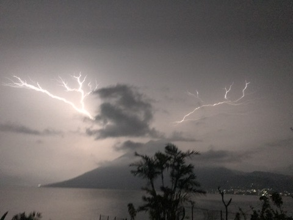

# Interactive Art Diary - Narrative Highlights

_A streamlined journey through the transformation from crisis to artistic breakthrough_

---

# Prologue: The Fall

## The Rise & Fall

On the surface, my life looked enviable. I threw incredible events, I was a successful musician, and when some of my friends became famous, it catapulted me into privileged circles—nights out with household names, insane parties around the globe, high-end adventures, and annual trips to Burning Man.

But underneath, I carried an old wound. At four years old, on my first day of school, I was surrounded by children chanting "Blackjack golliwog, blackjack golliwog." Half-African, half-English, raised in a white family - that was the moment I learned I was different, and that difference meant I didn't belong. I thought I'd left these wounds behind, but little did I know they were about to send me into the deepest abyss yet.

*Prescient from my avocado treehouse*

The crash came during my planned 2-year adventure. Four months into travels in Guatemala, staying in an avocado treehouse (I know! 🤪), financial disaster struck. Legal complications forced me to return to the UK immediately and buy out my entire mortgage, wiping out my funds. Suddenly, I couldn't continue the adventures that had become my identity. At 40, watching younger, wealthier friends surge ahead while I faced isolation and ruin, I crashed hard. Six months of digital numbness followed - endless TV, YouTube binges, crippling social anxiety around the circles where I used to move freely.

## The Hieroglyphics Breakthrough (2014-2016)

What most people didn't know was that during these peak years, I was quietly developing something revolutionary.

It started in 2014 with ayahuasca ceremonies. The medicine would flood my mind with hurricane insights, but the next morning, I could only read about half of what I'd written. After this happened repeatedly, I evolved from illegible scribbles to outline lettering, then to drawing pictures for each ceremony with all information contained within them. Prayers became fires with smoke flowing to stars. Growth intentions became trees with wishes in their leaves.

This coincided with discovering Anthony West's documentary on ancient Egypt, describing how mystery school initiates would scan hieroglyphic teachings - symbols representing multiple concepts simultaneously, allowing both brain hemispheres to process vast information and create synergy. It was a revolutionary moment - it felt like i was rediscovering an ancient technology for recording consciousness.

Over two years, my ceremony notes evolved into sophisticated visual languages, systematically refined through practice.

## The Eureka Moment

But during this dark period of depression, something extraordinary happened. I suddenly realized I could bring the sophisticated visual language I'd spent years developing in ceremonies into daily diary format. I could have that same special feeling of translating raw experience into visual expression, but applied to ordinary life - survival, recovery, the slow journey back to wholeness.

On September 13, 2017, I picked up a pen and created the first page. Not as art. Just as the most engaging way I could find to survive.

The diary was born from crisis, but it was powered by years of systematic innovation.

---

# Act I: Initiation

## The First Pages

In the deepest depression of my life the illustrated diary begins with a pivotal idea: _"However bad my life feels at this moment, I have to operate from the premise that at some point I'm going to make it through and achieve my dreams. If that is the case, it would be a wonderful self-study to track my journey from rock bottom to success... and a wonderful thing to be able to share with my kids and future generations."_

At first, it was basic, rudimentary. But something in the act of drawing slowed the storm, gave me something to hang onto. **One image at a time, creation became a lifeline** - a mirror pulling me back into feeling.

The diary was transforming pain into pathway.

## Black Pen Discovery

A pack of black pens, which i stumbled upon - fine liners in different weights - transformed chaotic drawings into sophisticated visual compositions with clear hierarchy and legibility.

## Visual Prayer Innovation

Seven months in, I stumbled into magic. I realized I could design each page's theme to portray the goal of what I wanted to happen. Each piece became a real-time prayer of intention, with diary content filling around the central vision. In my first example, I drew a disc representing digital addiction, with me splitting the habit in two. I found myself staring at a visual spell.

And it worked! (For a while 😉)

I realized each page could hold an intention, transforming drawing into functional ritual.

## External Validation

At an Apple Store, while getting my phone repaired, the Genius Bar attendant Vijay saw me drawing and said something that floored me: _"The hardest thing for an artist is to develop a style. You already have one."_

It was the first time anyone had acknowledged me as an artist. People in ceremonies had called my pictures "art" before, but I'd always rejected that notion due to my limited technical skills. But Vijay, being an artist himself, reflected back that technical skill wasn't the point - having a unique identity and style was the hardest part, and I already had that.

It was the first moment I realized this might have unique artistic identity, not just personal value.

## The System Emerges

What began as survival was becoming systematic innovation. I was developing a comprehensive visual language for consciousness - translating not just spiritual experiences, but the entire texture of daily life into compelling images.

The diary format evolved from A4 to double-page A3 spreads. Each page became more sophisticated, more intentional, more powerful. I wasn't just documenting recovery; I was inventing a new way to process reality itself.

Without realizing it, I was discovering something far more powerful than I had ever set out to find.

---

# Act II: Devotion

If Act I was survival and discovery, Act II was commitment and expansion.

## Vision Quest Journey

I took part in my first Vision Quest - a traditional Lakota initiation. Four days, four nights, no food, no water, alone in the Colombian rainforest. The preparation involved making 405 prayer ties, but when laying them around my quest spot, disaster struck. They were too loosely tied and fell apart. I spent three days unwrapping tangled prayer ties in the rain and mud.

But being in the forest without food or water, everything becomes metaphorical. I realized my prayers in life were as tangled as these prayers in my hands. The process of slowly unraveling them was internal work made visible. When they came to collect me, weak but transformed, an eagle soared directly above as I offered final prayers to the fire - a divine message that spirit was with me.

## Shadow Integration

That night I returned from the quest I battled my shadow self to the death in a lucid dream - as he died i say "I love you, you cunt" - two parts of me came back together.

## The Bridge Commitment

Falling desperately behind on my diary, I calculated it would take eight hours a day, six days a week, for two and a half months to catch up. This seemed insane, but something about unraveling those prayer ties felt connected to this task. I asked my dreams for guidance and was given an image: the Ponte Vecchio bridge in Florence.

The resulting piece depicts buildings on the bridge containing emotional stages, with "There is no turning back" written at the center beam. On the far side, a pyramid with a line to Orion's Belt - the cosmic destination. Even in overwhelm, the way forward was there, one page at a time.

## The Butterfly Emerges

Across the bridge... A butterfly with my turban and trainers - metamorphosis complete, ready to take flight... ready for the next transformation... while working on this i meet Chrissy who persuades me to transition to large scale...  art and reality align

---

# Act III: Transformation

If Act II was commitment and expansion, Act III was breakthrough and recognition.

## The Carnival Revelation

By the time I reached the butterfly's completion, I was nearly caught up with the diary after two months of relentless eight-hour days. I felt lighter, more alive. Then came the unexpected spark.

At Notting Hill Carnival, swept into a serendipitous adventure, I found myself showing my diary to new friends. One woman, Chrissy, grew quiet as she turned the pages, then looked up: "Why is this in a book? You're an artist. This is something special. These need to be big pieces - gallery pieces. This is like... Frieze-level."

I was completely gobsmacked. I'd never thought of it as "art" in the formal sense. But in that moment, everything clicked. All those hours, all that intensity - suddenly it wasn't madness, it was devotion.

I realized, with almost comic clarity: **I am an artist.**

## Scale Transformation

Chrissy's revelation inspired the move to large-scale artwork. The surfing piece was my first large-scale endeavor, marking a dramatic jump from A2 double pages to meter-wide minimum pieces. Some pieces reach 1.5 meters.

These weren't just bigger diary pages - they were sophisticated compositions that could hold their own in galleries while maintaining intimate diary content. The scale transformation was both physical and conceptual: exhibition pieces designed to be experienced as fine art.

## Slowing Down to Speed Up

A cheetah on a treadmill carried by turtles - artistic ambition meeting practical reality.

## The Memory Palace Mastery

The culmination came with my second Vision Quest in February 2020 - the final exhibition piece. After discovering Lynne Kelly's research on indigenous memory palaces, I assigned different trees around my camp specific categories with character guardians: Neo from The Matrix for mastery, The Rock for manifestation.

While working on a prayer about not belonging, something profound happened. Throughout four days, I hadn't seen a single bird. Suddenly, two canaries appeared, then a barranquero (the Vision Quest bird), then a toucan. It felt like an undeniable message from spirit that I could never not belong. I burst into uncontrollable tears.

The piece documents this whole inner world - prayer systems, jaguar visions, spirits, archetypal dreams. When I marched out with incredible power, these character guides walked beside me, holding huge amounts of prayers in just a few figures.

It's a memory palace, yes - but also a kind of temple. A living map of devotion.

## Time as Living Data

Since 2018, I'd been using time-tracking to manage myself. What started as productivity became artistic innovation. Each diary piece now comes with its own data story - how many hours of art, distraction, love, collapse went into creating it.

I realized each individual date could reveal its time statistics. Hover over a bolded date and see exactly what I did that day: 8.65 hours on art, yoga sessions, podcast time, moments of service. It creates unprecedented intimacy - part performance art, part data sculpture, part emotional transparency engine.

Time had become another medium in the work, adding depth never seen before in diary format. I was building a visualized cost of creation.

For more detail on the time data please read here: [Time Data Invitation – README](../6-time-data-invitation/0-README.md) 

## The Complete System

What began as survival had become art. What started as personal therapy had evolved into systematic innovation for processing human experience. Ancient memory techniques, visual prayer systems, data integration, interactive storytelling - all woven together into something that had never existed before.

The work was ready to move from private practice to public exhibition, from personal healing tool to shared map for others walking similar paths of conscious evolution.

---

_The physical artworks are exhibition-ready. The digital platform will create an unprecedented interactive experience, allowing global audiences to explore the intricate details and hidden stories within each piece through audio narration, time data, and immersive storytelling._