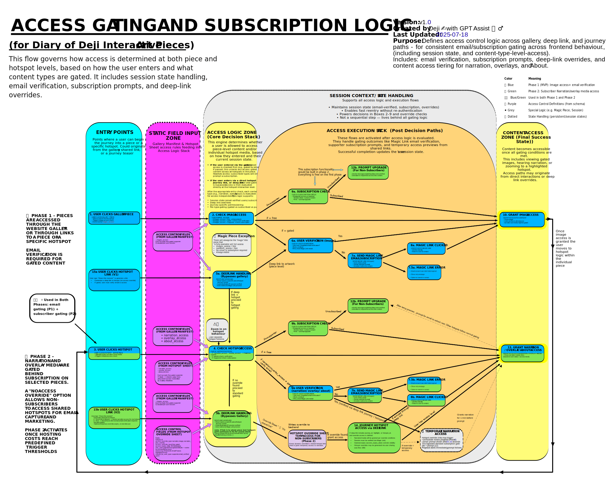

# Access Gating Flow

  This flow governs how access is determined at both piece and hotspot levels, based on how the user enters and what content types are gated. It includes session state handling, email verification, subscription prompts, and deep-link overrides._

  

**➡️ [Open full-size SVG](assets/access-gating-flow-chart.svg)**

