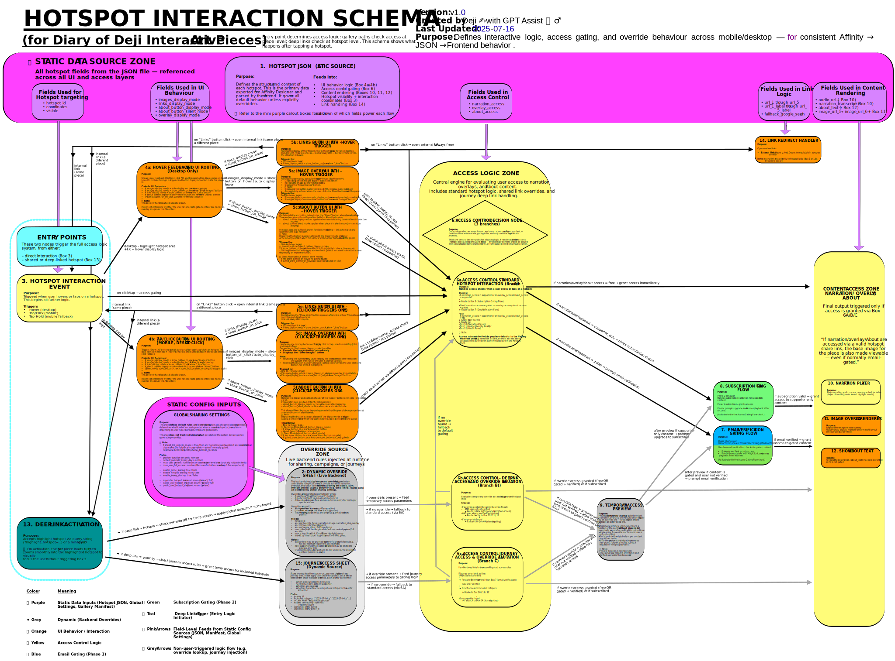

# Hotspot Schema

The content model for each hotspot: geometry (SVG coords), media (audio/images/video), link sets, access level, and playback behaviors (e.g., auto‑advance, highlights, journeys).

**➡️ [Open full-size SVG](assets/hotspot-schema.svg)**