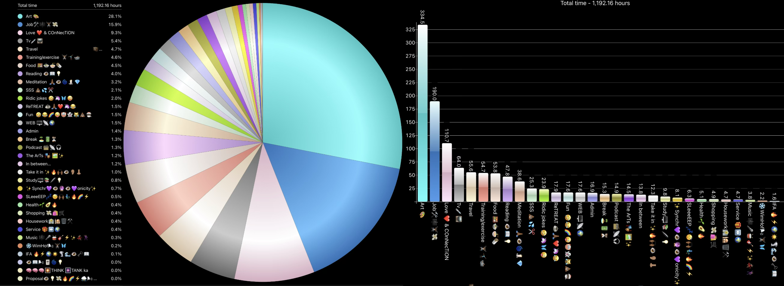
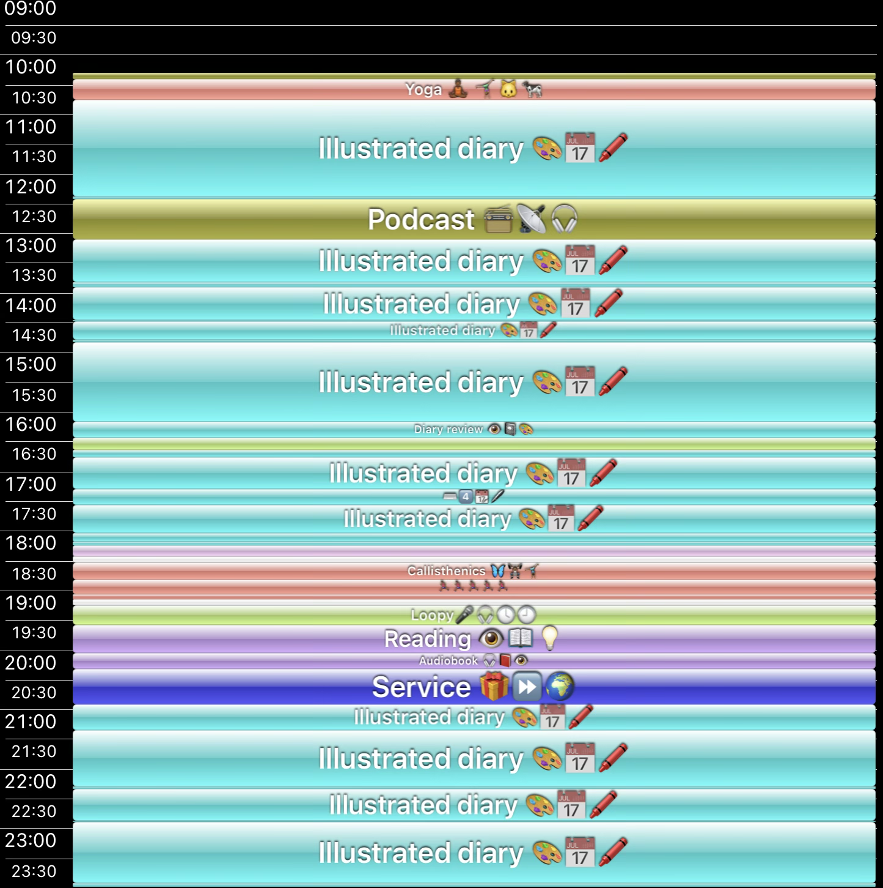

# Time Data Invitation

## Optional Context for Data-Excited Designers

**Quick version:** This folder shows examples of systematic time-tracking data that gets integrated into diary artworks. Feel free to skip if you're focused purely on visual design—this is bonus context for those interested in the data visualization aspects.

**Interested in the data layer?** Read on to see how personal analytics become artistic storytelling...

---

## What's Included

**Data Coverage:** Complete systematic documentation from **March 2018 through present day** - nearly 7 years of consistent granular time tracking. This isn't sporadic data—it's a comprehensive daily record covering the entire transformation period documented in the diary artworks.

### **📊 High-Level Categories** ([`nowthen_chart_year_2020_totals.csv`](nowthen_chart_year_2020_totals.csv))

**Top-level categories for the year:** 43 life domains tracked in 2020._  
**Key insight:** **Art 🎨: 1,408 hours** (nearly 4 hours daily average!)  
**Best for:** Understanding overall life patterns and creative dedication

### **🔍 Detailed Breakdown** ([`nowthen_chart_year_2020.csv`](nowthen_chart_year_2020.csv))

**More detailed breakdown of the same year:** 134 specific activities with parent categories  
**Key insight:** **Illustrated diary: 989 hours** + dozens of art sub-activities  
**Best for:** Understanding complexity levels available for UI design

### **📅 Daily Timeline** ([`nowthen_then_day_2024-08-13.csv`](nowthen_then_day_2024-08-13.csv))

**Single day drill-down:** Minute-by-minute activity tracking  
**Shows:** How daily granular data feeds into yearly patterns  
**Best for:** Timeline and pie chart interface concepts

### **🎨 Visual Examples**

### Visual Example – Pie Chart
How data becomes artistic pie charts within diary pages

### Visual Example – Daily Timeline
Timeline visualization showing the systematic nature of every day documentation

---

## How This Becomes Art

**The Innovation:** Personal analytics transformed into intimate artistic revelation. Time data becomes an integral layer of the artwork experience - often noting hours and duration within diary content, with detailed breakdowns available for each day.

**Design Flexibility:** This data integration offers exciting possibilities. The tracking app (Now Then Pro) exports pie charts and daily timeline visualizations. If designers aren't interested in custom data visualization, no problem - the static exported images will be added as rollover content for date hotspots on my side using the built-in hotspot functionality. However, if designers want to create dynamic visualizations, the raw data opens up possibilities ranging from hand-drawn aesthetic styles to high-tech presentations that create interesting contrast with the intimate diary artwork.

**The spectrum of possibilities:** From mimicking the organic, hand-drawn diary aesthetic to sleek, data-driven presentations that deliberately contrast with the artwork - we're curious how you would approach this creative tension between intimacy and technology.

**For UI designers:** Consider how to present quantified self data as emotional storytelling rather than cold analytics.

**If this excites you:** Think about creative ways to visualize systematic life documentation. How might hovering over a diary date reveal the "embodied time story" of that day?

---

## Design Possibilities (The Creative Spectrum)

- **Hand-drawn aesthetic:** Visualizations that feel organic and complement the diary's intimate nature
- **High-tech contrast:** Sleek, modern data presentations that create deliberate tension with hand-drawn artwork
- **Custom pie chart interfaces** that go beyond the standard app exports
- **Daily pattern reveals** showing how time was spent on specific dates
- **Mobile-friendly presentations** of complex time relationships
- **Rollover experiences** for date hotspots - from simple exported images to custom animations

**The question:** How do you balance intimacy with innovation? We're excited to see your creative approach to this tension.

---

_This systematic documentation represents artistic innovation: the first integration of detailed life analytics with hand-drawn diary practice at this scale. But if data visualization isn't your thing, focus on the main design briefs—the artworks speak for themselves._